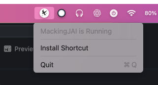
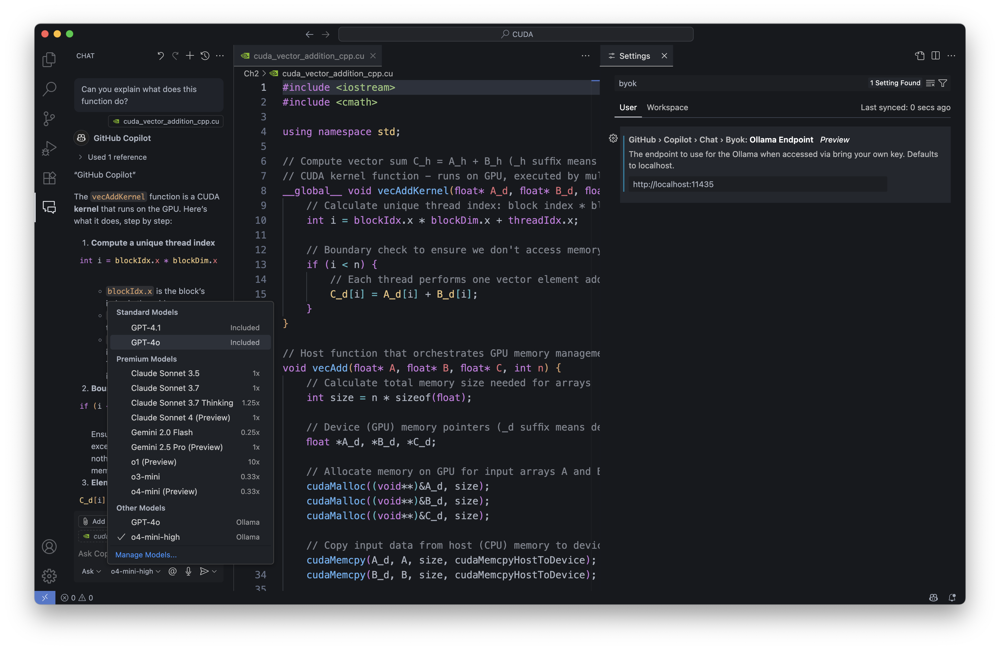

<div align = "center">
    <h1> MackingJAI </h1>
    
    <h3>Mocking OpenAI API through ChatGPT Desktop app</h3>
<br>


</div>

# Overview
MackingJAI mocks the process of using OpenAI API or Ollama API for chat models by using Apple Intelligence models or ChatGPT Mac app. Users can simplify the interaction with Apple Intelligence models or ChatGPT without using an API key.

You can use it for any application that uses OpenAI API or Ollama API to run.

> **🤖 Note:**  
> To use Apple Intelligence models, you need to have MacOS Tahoe 26


# Supported Models
**Supported Models:**

- **Apple Intelligence:**
  - `apple_local` (On device apple intelligence model)
  - `apple_cloud` (Private Cloud Compute apple intelligence model)

- **ChatGPT:**
  - `o4-mini-high`
  - `o4-mini`
  - `o3`
  - `GPT-4.5`
  - `GPT-4o`
  - `GPT-4.1`
  - `GPT-4.1-mini`

# Installation
- Download and install the DMG file from [releases](https://github.com/0ssamaak0/MackingJAI/releases)
- Install the shortcut by clicking on `Install Shortcut` from the menu icon or from [here](https://www.icloud.com/shortcuts/852b948c53474658bda1ebcb6574541c)



- Make sure you have ChatGPT Desktop app installed and running on your Mac.
- In any OpenAI API compatible request, set the API base to `http://127.0.0.1:11435/v1/` instead of `https://api.openai.com/v1` and set any value for the API key. The API key is not used in this mock.
- Or if using Ollama API, just change the API base from `http://127.0.0.1:11434` to `http://127.0.0.1:11435`. Nothing else is needed.
- The shortcut will automatically detect the request and send it to the ChatGPT Desktop app

Note: You may be asked to give some permissions to the shortcut to run. This is necessary for the shortcut to work properly.


## Usage
Theory, you can use any OpenAI API compatible library to make requests to the mocked API. However there are many limitations discussed below.

### Curl:
```bash
curl http://127.0.0.1:11435/v1/chat/completions \
    -H "Content-Type: application/json" \
    -H "Authorization: Bearer No need for API" \
    -d '{
        "model": "apple_cloud",
    "messages": [
        {
            "role": "system",
            "content": "You are a fact checker, answer with yes or no only"
        },
        {
            "role": "user",
            "content": "Paris is the capiatl of France"
        }
    ]
}'
```

## OpenAI Python
```python
from openai import OpenAI
client = OpenAI(api_key="No need for API", base_url="http://127.0.0.1:11435/v1/")

completion = client.chat.completions.create(
  model="gpt-4o",
  messages=[
    {"role": "developer", "content": "You are a helpful assistant."},
    {"role": "user", "content": "Hello!"}
  ]
)

print(completion.choices[0].message)
```

## LangChain 🦜🔗
```python
from langchain_openai import ChatOpenAI

llm = ChatOpenAI(
    model_name="gpt-4o",
    openai_api_base="http://127.0.0.1:11435/v1",
    openai_api_key="No key",
)
messages = [
    (
        "system",
        "You are a helpful assistant that translates English to French. Translate the user sentence.",
    ),
    ("human", "The quick brown fox jumps over the lazy dog"),
]
ai_msg = llm.invoke(messages)
print(ai_msg)
```

## Open-webui

Just add a new Ollama API connection with the URL `http://host.docker.internal:11435`

- If you don't use docker, check the URL of Ollama in Ollama API and replace `11434` with `11435` in the URL

> **Tip:** If you are using reasoning models like `o3` or `o4-mini`, it's better to set a different model for Title and Tag Generation.  
> Navigate to `Settings > Admin Settings > Interface > Set Task Model` and choose a non-reasoning model. This will save your quota and speed up the generation process.

## Raycast AI
MackingJAI can be used for Raycast AI, just change Ollama Route from `11434` to `11435` in the Raycast AI settings. It will access all available models in your ChatGPT Desktop app.


## GitHub Copilot
To use MackingJAI with GitHub Copilot, you need to set the Ollama endpoint to `http://localhost:11435` in the GitHub Copilot settings. Then select the models you want to use from the dropdown menu.




# Limitations
- Everything is limited by your chatgpt desktop application and your subscription including available models, rate limits and generation speed.
- There's no way to set the system prompt or use any other parameters.
- You can't send images in this mock.

# Models
By default, all available models in your ChatGPT Desktop app are available in MackingJAI. 
- If you are using a code that uses OpenAI API with acertain snapshot e.g., `gpt-4o-2024-05-13` you will be redirected to the same model.
- `GPT4.1` models are not supported since they are API exclusive. So `gpt-4.1`, `gpt-4.1-mini`, and `gpt-4.1-nano` are redirected to `GPT-4`, `GPT-4o` and `GPT-4o-mini` respectively.

# Todo
- ~~Explore how to integrate conversation history~~ ✅
- ~~Explore how to integrate system prompt if possible~~ ✅
- Create a homebrew cask for easy installation
- Explore similar functionality for Windows users
